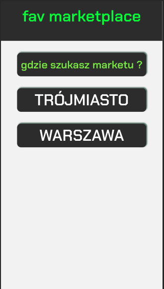
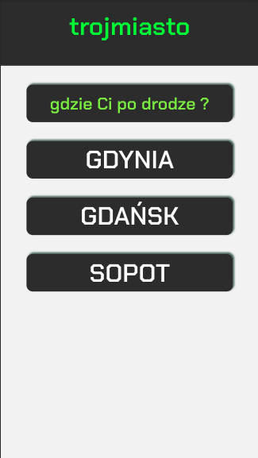
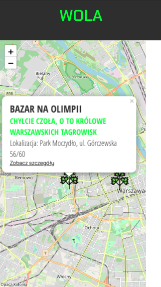
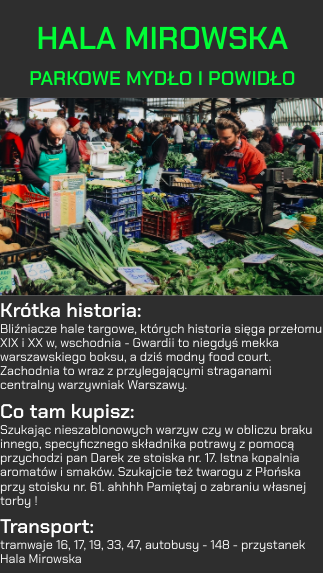

### This project is a mobile app that will bring you closer to choosing your favorite and environmentally friendly marketplace and all without using plastic bags!
#### Currently contains information about Warsaw and Tricity marketplaces. In the application you can locate the nearest market on the map. I use the [React-Leaflet](https://react-leaflet.js.org/) library for this.

> Here's a little teaser of how it looks:
>
> 
>   

### How to run the project: 
#### Precondition: You have installed
 * `node.js`>= 8.x
 * `npm` >= 5.x
 * `react-dom` >= 16.3.x 
 * `react-leaflet` >= 2.x
 * `firebase` >= 7.x
 * `node-sass` >= 4.x
 
 1. Install dependencies: run `npm install`
 2. Run `npm start`
 3. Server should be available under `localhost:3000` by default
 
 
